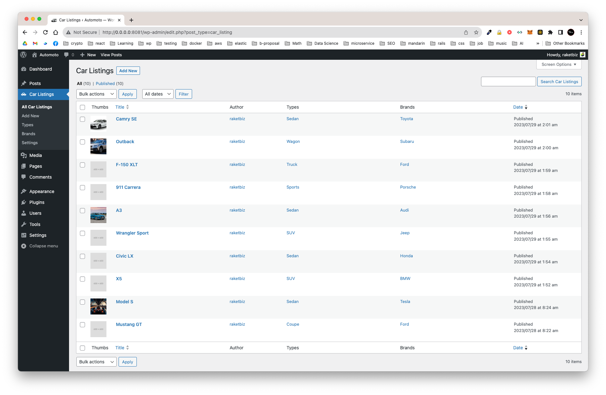

# Car Listing Plugin for WordPress

This plugin provides the functionality to list cars on your WordPress website. Users can add car details, and the plugin offers templates for both the archive and single views.

## Screenshots



## Directory Structure

```bash
.
├── README.md
├── car-listing.php
├── images
│ ├── carplaceholder.png
│ └── placeholder_50.png
└── inc
├── brand-taxonomy.php
├── car-listings-handler-sc.php
├── class-car-listing-core.php
├── class-car-listing-rest-controller.php
├── listing-setting.php
├── meta-boxes.php
├── plugin-activation.php
├── post-types.php
├── template
│ ├── archive-car_listing.php
│ └── single-car_listing.php
├── thumbnails.php
├── type-taxonomy.php
└── widget-listing.php
```

## How to Use the Plugin

1. **Installation**:

   - Download the `car-listing-plugin.zip` file.
   - Log in to your WordPress dashboard.
   - Navigate to `Plugins > Add New > Upload Plugin`.
   - Browse to the downloaded zip file and click `Install Now`.
   - After installation, activate the plugin.

2. **Adding New Car Listing**:

   - Navigate to `Dashboard > Car Listings > Add New`.
   - Fill in the car details such as title, description, featured image, and custom fields.
   - Publish your listing.

3. **Using Shortcodes**:

   - Use the shortcode `[car_listings]` to display car listings in any post or page.
   - For specific listings, use the shortcode with the ID attribute, e.g., `[car_listings id="123"]`.

4. **Displaying Car Listings**:

   - The plugin provides a widget named "Car Listing Widget" with custom settings.
   - Add this widget to any sidebar or widgetized area to showcase the latest car listings.
   - The custom archive index listing and custom single page templates can be found in the `templates/` directory.

5. **Plugin Settings**:

   - Go to `Dashboard > Car Listing Settings` to configure default settings.
   - Here, you can set a default car listing image and other global settings.

6. **API Integration**:
   - The plugin is API ready, allowing developers to fetch or send data to external systems. Check the documentation for API endpoints and usage guidelines.

## Notes

This plugin is designed with extensibility in mind. Developers can easily extend its functionalities using the provided hooks, filters, and templates. Make sure to always back up your website before making major changes or updates to the plugin.

---

Developed by Ruel Nopal
